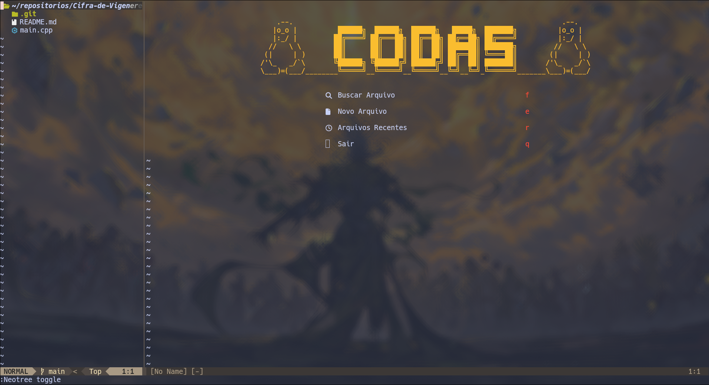

# Hyprland Config

Configuração personalizada para **Hyprland** (Wayland compositor) com foco em produtividade, aparência moderna e animações suaves.

<details>
  <summary>Detalhes</summary>

Inclui:

* Layout **dwindle** com pseudotile
* Workspaces inteligentes
* Configuração de keybindings completa
* Suporte a touchpad, gestos e múltiplos monitores
* Barra de status com **Waybar**
* Integração com clipboard (`wl-paste`/`cliphist`)
* Suporte a NVIDIA / drivers gráficos
* Tema visual com bordas arredondadas, sombras e blur

---

## Dependências

Para usar esta configuração corretamente, você precisa instalar alguns programas e bibliotecas essenciais.

### Arch Linux 

```bash
sudo pacman -S hyprland kitty thunar rofi waybar blueman wl-clipboard hyprpaper polkit-gnome playerctl brightnessctl
```

Opcional (recomendado):

```bash
sudo pacman -S firefox nerd-fonts-complete xorg-xhost
```


> 💡 **Observação:** Também é recomendado instalar uma **Nerd Font** para que os ícones apareçam corretamente no Waybar e no Rofi.

---

# Programas padrão configurados

* Terminal: `kitty`
* Gerenciador de arquivos: `thunar`
* Menu / launcher: `rofi -show drun -show-icons`
* Navegador: `firefox`

---

# Autostart

Processos iniciados automaticamente:

* Polkit agent (GNOME)
* Waybar (barra de status)
* Blueman-applet (gerenciador Bluetooth)
* `wl-paste` para histórico do clipboard
* Hyprpaper (papel de parede)

---

# Keybindings principais

| Atalho               | Função                                           |
| -------------------- | ------------------------------------------------ |
| Super + Return       | Abrir terminal                                   |
| Super + F            | Abrir navegador                                  |
| Super + E            | Abrir gerenciador de arquivos                    |
| Super + Space        | Abrir menu (rofi)                                |
| Super + C            | Fechar janela ativa                              |
| Super + M            | Sair do Hyprland                                 |
| Super + V            | Alternar janela flutuante                        |
| Super + P            | Alternar pseudo layout                           |
| Super + J / L        | Alternar split / mover janelas                   |
| Super + H            | Histórico clipboard via rofi                     |
| Super + Q/A/S        | Screenshot (região/janela/monitor)               |
| Super + Escape       | Reinicia Waybar                                  |
| Super + setas        | Mover foco da janela                             |
| Super + 1..0         | Trocar workspace                                 |
| Super + Shift + 1..0 | Mover janela ativa para workspace correspondente |

### Multimídia / Volume / Brilho

* XF86AudioRaiseVolume / Lower / Mute
* XF86AudioMicMute
* XF86MonBrightnessUp / Down
* Controle de música via **playerctl**

---

# Monitores

Exemplo de configuração multi-monitor:

```text
monitor = eDP-1,1920x1080@60,0x0,1.0
monitor = HDMI-A-1,1920x1080@75,1920x0,1.0
```

---

# Aparência

* Layout: **dwindle** com pseudotile
* Borda ativa: laranja → amarelo (Gruvbox)
* Borda inativa: cinza (Gruvbox)
* Shadow e blur ativados
* Opacidade: janelas ativas 1.0, inativas 0.99
* Arredondamento de bordas configurável

---

# Animações

* Suavização via curvas Bezier
* Fade, popin, border, layers, workspace transitions

</details>

---


# Waybar

Configuração minimalista e funcional da **Waybar** com tema **Gruvbox**, feita para combinar com o Neovim e otimizar o fluxo de trabalho no **Hyprland**.


<details>
<summary>Detalhes</summary>

---

## Dependências

### Arch Linux

```bash
sudo pacman -S waybar ttf-jetbrains-mono-nerd network-manager-applet pavucontrol wlogout
```

```bash
yay -S wlogout
```

### Fontes e Ícones
Para que os ícones (Arch, Bateria, CPU) apareçam corretamente, é necessário instalar uma **Nerd Font**. O comando acima já inclui a `ttf-jetbrains-mono-nerd`, que é a recomendada para esta configuração.

---

## Módulos

Esta configuração utiliza os seguintes módulos organizados para máxima eficiência:

- **Lado Esquerdo**: 
  - Logo do Arch (``) — Atalho para o lançador de apps.
  - Workspaces Inteligentes — Mostra apenas os números das áreas de trabalho ativas ou ocupadas.
- **Centro**: 
  - Relógio e Data — Com calendário detalhado ao passar o mouse.
- **Lado Direito**: 
  - Volume (Pulseaudio) — Clique para abrir o controle de áudio.
  - Memória RAM — Monitoramento de consumo em tempo real.
  - CPU — Uso do processador com tooltip detalhado.
  - GPU — Monitoramento de carga da placa de vídeo (Nvidia).
  - Rede/Wi-Fi — Mostra o IP Local ao passar o mouse.
  - Bateria — Ícones dinâmicos que mudam conforme a carga.
  - Botão Power (``) — Abre o menu de desligamento seguro.

---

## Atalhos e Interações

| Módulo | Ação | Função |
| :--- | :--- | :--- |
| **Logo Arch** | Clique | Abre o Rofi / Lançador de Apps |
| **Workspaces** | Clique | Alterna entre áreas de trabalho |
| **Volume** | Clique | Abre o Pavucontrol (Mixer de Áudio) |
| **Rede** | Hover | Mostra o IP Local do computador |
| **Power** | Clique | Abre o menu de desligamento (wlogout) |

---

## Instalação

Crie a pasta de configuração da Waybar:

```bash
mkdir -p ~/.config/waybar
```

Coloque os arquivos `config` e `style.css` dentro da pasta:

```bash
~/.config/waybar/config
~/.config/waybar/style.css
```

Para aplicar as mudanças, reinicie a Waybar:

```bash
pkill waybar && waybar &
```

</details>


---


# Neovim

Configuração simples de **Neovim** feita para estudo e uso diário.
Os plugins são gerenciados automaticamente usando **lazy.nvim**.



<details>
  <summary>Detalhes</summary>

---

## Dependências

### Arch Linux

```bash
sudo pacman -S neovim git ripgrep
```

### Debian / Ubuntu

```bash
sudo apt install neovim git ripgrep
```


Também é recomendado instalar uma **Nerd Font** para que os ícones funcionem corretamente no editor.

---

## Plugins

Esta configuração utiliza os seguintes plugins:

* gruvbox — tema

* alpha-nvim — dashboard inicial

* lualine.nvim — barra de status

* neo-tree.nvim — explorador de arquivos

* toggleterm.nvim — terminal integrado

* nvim-autopairs — fechamento automático de parênteses

* nvim-treesitter — highlight de sintaxe

* telescope.nvim — busca de arquivos e texto

* nvim-cmp — autocomplete

* LuaSnip — snippets

* gitsigns.nvim — indicadores de alterações do Git

* which-key.nvim — exibe atalhos disponíveis

* indent-blankline.nvim — guias visuais de indentação

Todos os plugins são instalados automaticamente pelo **lazy.nvim**.

---

## LSP (Language Server)

A configuração utiliza **LSP nativo do Neovim** para fornecer:

* autocompletar
* navegação de código
* documentação
* renomeação de símbolos
* ações rápidas

Os servidores são instalados automaticamente usando **mason.nvim**.

LSPs incluídos:

* **lua_ls** — suporte para Lua
* **clangd** — suporte para C / C++
* **ts_ls** — suporte para JavaScript / TypeScript

---

## Atalhos principais

| Atalho     | Função                                |
| ---------- | ------------------------------------- |
| Ctrl + n   | Abrir / fechar explorador de arquivos |
| Ctrl + t   | Abrir / fechar terminal               |
| Space + ff | Buscar arquivos                       |
| Space + fg | Buscar texto no projeto               |

Leader key: `Space`

---

## Atalhos do LSP

| Atalho     | Função               |
| ---------- | -------------------- |
| gd         | Ir para definição    |
| K          | Mostrar documentação |
| Space + rn | Renomear símbolo     |
| Space + ca | Code action          |

---

## Atalhos úteis

### Git

| Atalho | Função             |
| ------ | ------------------ |
| ]c     | Próxima alteração  |
| [c     | Alteração anterior |

---

## Instalação

Crie a pasta de configuração:

```bash
mkdir -p ~/.config/nvim
```

Coloque o arquivo `init.lua` dentro da pasta:

```
~/.config/nvim/init.lua
```

Abra o Neovim:

```bash
nvim
```

Na primeira execução o **lazy.nvim** irá instalar todos os plugins automaticamente.

</details>

---


